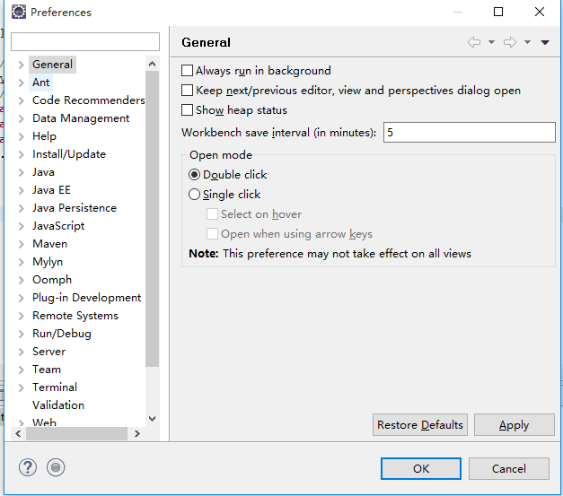
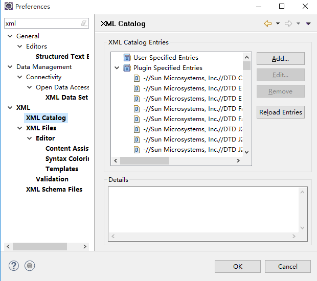
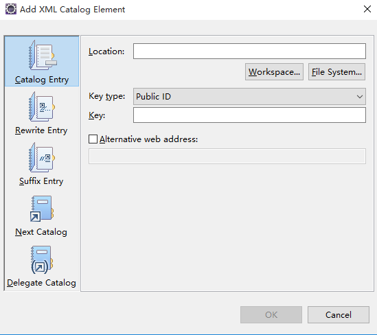
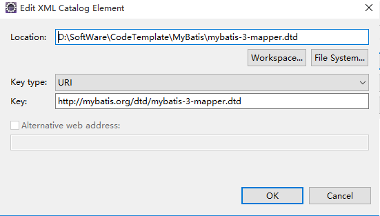
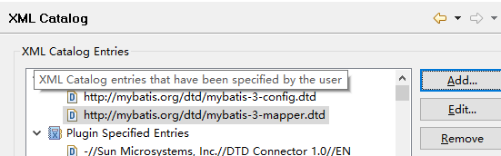

# 2 搭建框架提示模板

## 2.1 创建数据库及数据库表

数据库及数据库表结构脚本语句如下：

	create database mybatis character set utf8 collate utf8_general_ci;
	
	use mybatis;
	
	create table users(
	    id bigint(20) not null auto_increment primary key comment '主键',
	    username varchar(40) comment '用户名',
	    password varchar(40) comment '密码'
	);

## 2.2 MyBatis框架提示模板

1：将MyBatis标签提示模板放在与eclipse搭配的固定文件位置

MyBatis标签提示模板文件：

    mybatis-3-config.dtd
    mybatis-3-mapper.dtd

可以存放在D:\SoftWare\CodeTemplate\MyBatis目录下

2：打开eclipse进行配置

打开eclipse的菜单栏“Window ——> Preferences”，会出现如下显示窗口：

 

从该窗口的搜索框中搜索“xml”，显示如下窗口：

 

在该窗口的左侧菜单中选择XML下的Catalog项，点击该窗口中右侧的“add”按钮，页面弹出如下窗口：

 

在该窗口中点击“File System...”按钮，将之前的文件“mybatis-3-config.dtd”进行选择，同时在窗口中的key项中填写：

    http://mybatis.org/dtd/mybatis-3-config.dtd

注意，在该窗口的"Key Type"选项选择“URI”。

 

以同样方式在该窗口中增加“mybatis-3-mapper.dtd”文件的配置，并在窗口中的key项中填写：

    http://mybatis.org/dtd/mybatis-3-mapper.dtd

最终配置结果如下图所示：

 

