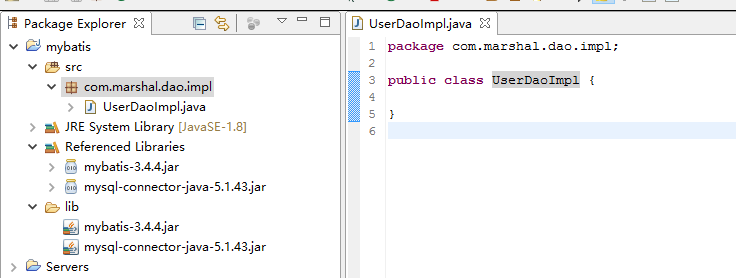

# 3 环境搭建

## 3.1 导入Mybatis所需要的jar包

Mybatis所需要的jar包有两个：

    mybatis-3.4.4.jar
    mysql-connector-java-5.1.43.jar

新建普通java项目mybatis，并将以上两个jar包加入到build path里面，在包com.marshal.dao.impl中创建类UserDaoImpl。

 

## 3.2 编写Mybatis主配置文件

在项目中创建source forder(资源文件夹)，命名为“resource”，在该资源文件夹中创建mybatis.xml主配置文件。  
主配置文件的内容：  

	<?xml version="1.0" encoding="UTF-8"?>
	<!DOCTYPE configuration
	PUBLIC "-//mybatis.org//DTD Config 3.0//EN"
	"http://mybatis.org/dtd/mybatis-3-config.dtd">
	<configuration>
	    <!-- 配置数据库连接环境：driver、url、username、password -->
	    <environments default="mysql">
	        <!-- 开始配置mysql -->
	        <environment id="mysql">
	            <!-- 配置事务 -->
	            <transactionManager type="JDBC"></transactionManager>
	            <dataSource type="POOLED">
	                <property name="driver" value="com.mysql.jdbc.Driver"/>
	                <property name="url" value="jdbc:mysql:///mybatis"/>
	                <property name="username" value="root"/>
	                <property name="password" value="root"/>
	            </dataSource>
	        </environment>
	    </environments>
	</configuration>

其中envirments标签中的default属性指的的默认的envirment，这个属性的值为选定默认的envirment的id属性值。  
envirment可以配置多个，可以是mysql也可以是oracle。

## 3.3 编写局部配置文件

在包com.marshal.entity中新建一个类User：

    package com.marshal.entity;

	/**
	 * User需要满足JavaBean格式
	 * @author Steven
	 *
	 */
	public class User {
	
		//主键
		private Long id;
		
		//用户名
		private String username;
		
		//密码
		private String password;
	
		public Long getId() {
			return id;
		}
	
		public void setId(Long id) {
			this.id = id;
		}
	
		public String getUsername() {
			return username;
		}
	
		public void setUsername(String username) {
			this.username = username;
		}
	
		public String getPassword() {
			return password;
		}
	
		public void setPassword(String password) {
			this.password = password;
		}
	
		@Override
		public String toString() {
			return "User [id=" + id + ", username=" + username + ", password=" + password + "]";
		}
		
	}

在UserDaoImpl类中新建一个方法：

	package com.marshal.dao.impl;
	
	/**
	 * 
	 * @author Steven
	 *
	 */
	public class UserDaoImpl {
	
		/**
		 * 
		 */
		public void getAllUser(){
			
		}
	}

在包com.marshal.dao.impl中添加局部配置文件UserDaoImpl.xml：

	<?xml version="1.0" encoding="UTF-8"?>
	<!DOCTYPE mapper
	PUBLIC "-//mybatis.org//DTD Mapper 3.0//EN"
	"http://mybatis.org/dtd/mybatis-3-mapper.dtd">
	<!-- namespace：命名空间（一个局部配置文件只有一个），器值为某一个dao层的具体路径 -->
	<mapper namespace="com.marshal.dao.impl.UserDaoImpl">
	    <!-- sql语句保存在Mybatis的局部配置文件中 -->
	    <!-- 
	        select标签存放查询语句
	            id：在整个配置文件中id值必须唯一，其值为方法名 
	            resultType：指定当前sql查询语句返回的数据类型，类型不是为sql语句的最终类型，而是（List<User>）
	    -->
	    <select id="getAllUser" resultType="com.marshal.entity.User">
	        SELECT * FROM users
	    </select>
	</mapper>

由于主配置文件Mybatis在resource目录下和局部配置文件UserDaoImpl.xml在com.marshal.dao.impl目录下，所以需要将主配置文件和局部配置文件进行关联。
在主配置文件中增加如下部分：

	<!-- 关联局部配置文件 -->
    <mappers>
    	<mapper resource="com/marshal/dao/impl/UserDaoImpl.xml"/>
    </mappers>

增加以上部分后，主配置文件的内容为：

	<?xml version="1.0" encoding="UTF-8"?>
	<!DOCTYPE configuration
	PUBLIC "-//mybatis.org//DTD Config 3.0//EN"
	"http://mybatis.org/dtd/mybatis-3-config.dtd">
	<configuration>
	    <!-- 配置数据库连接环境：driver、url、username、password -->
	    <environments default="mysql">
	        <!-- 开始配置mysql -->
	        <environment id="mysql">
	            <!-- 配置事务 -->
	            <transactionManager type="JDBC"></transactionManager>
	            <dataSource type="POOLED">
	                <property name="driver" value="com.mysql.jdbc.Driver"/>
	                <property name="url" value="jdbc:mysql:///mybatis"/>
	                <property name="username" value="root"/>
	                <property name="password" value="root"/>
	            </dataSource>
	        </environment>
	    </environments>
	    
	    <!-- 关联局部配置文件 -->
	    <mappers>
	    	<mapper resource="com/marshal/dao/impl/UserDaoImpl.xml"/>
	    </mappers>
	</configuration>

## 3.4 启动Mybatis框架并测试

完善UserDaoImpl类中的getAllUser()方法，并进行测试：

	@Test
	public void getAllUser() throws IOException{
		// 1、启动mybatis框架，首先
        // SqlSession---->SqlSessionFactory---->SqlSessionFactoryBuilder
        SqlSessionFactoryBuilder sfb = new SqlSessionFactoryBuilder();
        // 将mybatis.xml文件转化成流
        InputStream ins = Resources.getResourceAsStream("mybatis.xml");
        SqlSessionFactory ssf = sfb.build(ins);
        SqlSession session = ssf.openSession();
        // 2、调用局部配置文件中的sql语句
        List<User> userList = session.selectList("com.marshal.dao.impl.UserDaoImpl.getAllUser");
        for (User user : userList) {
            System.out.println(user);
        }
	}

整个UserDaoImpl类的内容：

	package com.marshal.dao.impl;
	
	import java.io.IOException;
	import java.io.InputStream;
	import java.util.List;
	
	import org.apache.ibatis.io.Resources;
	import org.apache.ibatis.session.SqlSession;
	import org.apache.ibatis.session.SqlSessionFactory;
	import org.apache.ibatis.session.SqlSessionFactoryBuilder;
	import org.junit.Test;
	
	import com.marshal.entity.User;
	
	/**
	 * 
	 * @author Steven
	 *
	 */
	public class UserDaoImpl {
	
		/**
	     * 
	     * Description: 获取users表中的所有数据记录 
	     *
	     * @throws IOException
	     */
	    @Test
		public void getAllUser() throws IOException{
			// 1、启动mybatis框架，首先
	        // SqlSession---->SqlSessionFactory---->SqlSessionFactoryBuilder
	        SqlSessionFactoryBuilder sfb = new SqlSessionFactoryBuilder();
	        // 将mybatis.xml文件转化成流
	        InputStream ins = Resources.getResourceAsStream("mybatis.xml");
	        SqlSessionFactory ssf = sfb.build(ins);
	        SqlSession session = ssf.openSession();
	        // 2、调用局部配置文件中的sql语句
	        List<User> userList = session.selectList("com.marshal.dao.impl.UserDaoImpl.getAllUser");
	        for (User user : userList) {
	            System.out.println(user);
	        }
		}
	}

运行后的测试结果：

	User [id=1, username=王小山, password=123456]
	User [id=2, username=王小立, password=123456]