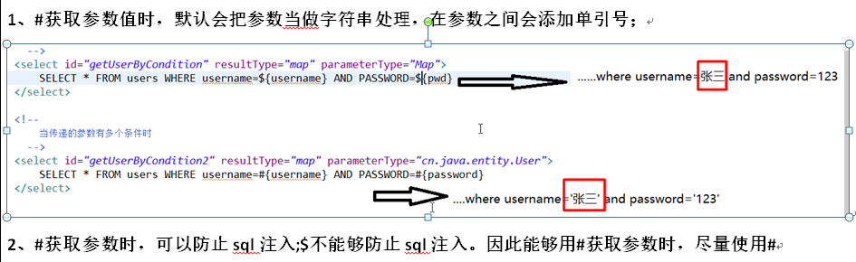

# 6 带多个参数的查询

## 6.1 将查询条件封装在Map中获取数据

在com.marshal.dao.impl.UserDaoImpl类中增加多条件查询方法：

	@Test
    public void getUserByCondition() throws IOException {
        // 同时传递多个参数
        Map<String, Object> paramMap = new HashMap<String, Object>();
        paramMap.put("username", "王小山");
        paramMap.put("pwd", "123456");
        Map<String, Object> userMap = session.selectOne("com.marshal.dao.impl.UserDaoImpl.getUserByCondition", paramMap);
        System.out.println(userMap);
    }

以上为多个参数封装在Map里面进行查询。

在com.marshal.dao.impl文件夹下的UserDaoImpl.xml文件中增加如下配置：

	<!--
		当传递的参数有多个条件时
	  -->
	<select id="getUserByCondition" resultType="map" parameterType="Map">
		SELECT * FROM users WHERE username='${username}' AND PASSWORD='${pwd}'
	</select>

以上为多个参数传递时被封装在了Map集合当中，且集合当中的取值是通过key值获取的。

## 6.2 将查询条件封装在对象中获取数据

在com.marshal.dao.impl.UserDaoImpl类中增加多条件查询方法：

    @Test
    public void getUserByCondition2() throws IOException {
        // 同时传递多个参数
        User user = new User();
        user.setUsername("王小立");
        user.setPassword("123456");
        Map<String, Object> userMap = session.selectOne("com.marshal.dao.impl.UserDaoImpl.getUserByCondition2", user);
        System.out.println(userMap);
    }

以上为多个参数封装在对象中进行查询。

	<!--
		当传递的参数有多个条件时
	  -->
	<select id="getUserByCondition2" resultType="map" parameterType="com.marshal.entity.User">
		SELECT * FROM users WHERE username=#{username} AND PASSWORD=#{password}
	</select>

该查询数据的参数类型为User实体类。

## 6.3 Mybatis中通过$和\#符号取数据的区别

 