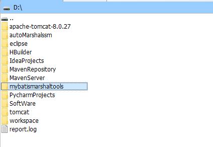
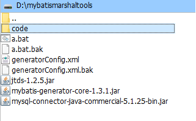

# 14 逆向工程（实体类及局部配置自动生成）

## 14.1 存放逆向工程工具

首先将逆向工程工具文件夹放置在D盘目录下，如下图所示：

 

## 14.2 编辑修改配置

### 14.2.1 修改工具文件夹中的a.bat文件

将原来的路径：

    java -jar E:\mybatis-generator-core-1.3.1.jar -configfile E:\generatorConfig.xml -overwrite

进行一一对应的修改为当前路径：

    java -jar D:\mybatismarshaltools\mybatis-generator-core-1.3.1.jar -configfile D:\mybatismarshaltools\generatorConfig.xml -overwrite

### 14.2.2 修改工具文件夹中的generatorConfig.xml文件

文件中的原内容为：

	<?xml version="1.0" encoding="UTF-8" ?>
	<!DOCTYPE generatorConfiguration PUBLIC "-//mybatis.org//DTD MyBatis Generator Configuration 1.0//EN" "http://mybatis.org/dtd/mybatis-generator-config_1_0.dtd" >
	<generatorConfiguration>
		<classPathEntry location="mysql-connector-java-commercial-5.1.25-bin.jar" />
		<context id="context1">
			<commentGenerator>
				<property name="suppressDate" value="true" />
				<property name="suppressAllComments" value="true"/>
			</commentGenerator>
			<jdbcConnection driverClass="com.mysql.jdbc.Driver"
				            connectionURL="jdbc:mysql://43.254.54.251:3306/tezhongche"
				            userId="root" 
							password="123.com">
			</jdbcConnection>
			<javaTypeResolver>
				<property name="forceBigDecimals" value="false" />
			</javaTypeResolver>
			<javaModelGenerator  targetPackage="cn.bluemobi.entity" targetProject="E:\yj" />
			<sqlMapGenerator targetPackage="cn.bluemobi.service" targetProject="E:\yj" />
			<javaClientGenerator targetPackage="cn.bluemobi.service.impl" targetProject="E:\yj" type="XMLMAPPER">
				<property name="enableSubPackages" value="true" />
			</javaClientGenerator>
	
			<table tableName="advertisement" domainObjectName="Advertisement" enableCountByExample="false" enableUpdateByExample="false" enableDeleteByExample="false" enableSelectByExample="false" selectByExampleQueryId="false"></table>
	
	    </context>
	</generatorConfiguration>

首先对数据库连接部分进行修改：

    <jdbcConnection driverClass="com.mysql.jdbc.Driver"
		            connectionURL="jdbc:mysql://localhost:3306/mybatis"
		            userId="root" 
					password="root">
	</jdbcConnection>

在逆向工程工具文件夹中新建代码文件夹code文件夹，便于存放生成的文件：

 

将原来的包名及库名进行修改如下：

原来：

    <javaModelGenerator 
        targetPackage="cn.bluemobi.entity" 
        targetProject="E:\yj" />
        
	<sqlMapGenerator 
	    targetPackage="cn.bluemobi.service" 
	    targetProject="E:\yj" />
	    
	<javaClientGenerator 
	    targetPackage="cn.bluemobi.service.impl" 
	    targetProject="E:\yj" 
	    type="XMLMAPPER">
		<property name="enableSubPackages" value="true" />
	</javaClientGenerator>

修改为：

    <javaModelGenerator  
	    targetPackage="com.marshal.entity" 
		targetProject="D:\mybatismarshaltools\code" />

	<sqlMapGenerator 
	    targetPackage="com.marshal.service" 
		targetProject="D:\mybatismarshaltools\code" />

	<javaClientGenerator 
	    targetPackage="com.marshal.service.impl" 
		targetProject="D:\mybatismarshaltools\code" 
		type="XMLMAPPER">
		<property name="enableSubPackages" value="true" />
	</javaClientGenerator>

将数据库中需要进行映射的表名进行修改：

原来：

    <table tableName="advertisement" domainObjectName="Advertisement" enableCountByExample="false" enableUpdateByExample="false" enableDeleteByExample="false" enableSelectByExample="false" selectByExampleQueryId="false"></table>

修改为：

    <table tableName="computers" domainObjectName="Computer" enableCountByExample="false" enableUpdateByExample="false" enableDeleteByExample="false" enableSelectByExample="false" selectByExampleQueryId="false"></table>

配置文件最终被修改为：

	<?xml version="1.0" encoding="UTF-8" ?>
	<!DOCTYPE generatorConfiguration PUBLIC "-//mybatis.org//DTD MyBatis Generator Configuration 1.0//EN" "http://mybatis.org/dtd/mybatis-generator-config_1_0.dtd" >
	<generatorConfiguration>
		<classPathEntry location="mysql-connector-java-commercial-5.1.25-bin.jar" />
		<context id="context1">
			<commentGenerator>
				<property name="suppressDate" value="true" />
				<property name="suppressAllComments" value="true"/>
			</commentGenerator>
	
			<jdbcConnection driverClass="com.mysql.jdbc.Driver"
				            connectionURL="jdbc:mysql://43.254.54.251:3306/tezhongche"
				            userId="root" 
							password="123.com">
			</jdbcConnection>
	
			<javaTypeResolver>
				<property name="forceBigDecimals" value="false" />
			</javaTypeResolver>
	
			<javaModelGenerator  
			    targetPackage="com.marshal.entity" 
				targetProject="D:\mybatismarshaltools\code" />
	
			<sqlMapGenerator 
			    targetPackage="com.marshal.service" 
				targetProject="D:\mybatismarshaltools\code" />
	
			<javaClientGenerator 
			    targetPackage="com.marshal.service.impl" 
				targetProject="D:\mybatismarshaltools\code" 
				type="XMLMAPPER">
				<property name="enableSubPackages" value="true" />
			</javaClientGenerator>
	
			<table tableName="advertisement" domainObjectName="Advertisement" enableCountByExample="false" enableUpdateByExample="false" enableDeleteByExample="false" enableSelectByExample="false" selectByExampleQueryId="false"></table>
	
	    </context>
	</generatorConfiguration>

## 14.3 执行工具

双击工具文件夹中的a.bat文件进行自动化执行。