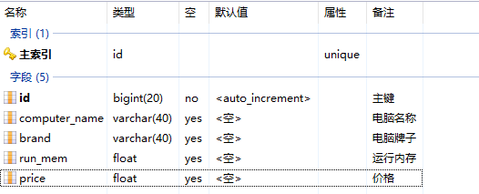

# 16 逆向工程生成实体类驼峰命名

当数据库中的表结构的字段名称是以“\_”下划线相隔的情况时：

 

通过逆向工程所创建的java实体类中的字段名是小驼峰结构：

	package com.marshal.entity;
	
	public class Computer {
	
	    private Long id;
	
	    private String computerName;
	
	    private String brand;
	
	    private Float runMem;
	
	    private Float price;
	
	    public Long getId() {
	        return id;
	    }
	
	    public void setId(Long id) {
	        this.id = id;
	    }
	
	    public String getComputerName() {
	        return computerName;
	    }
	
	    public void setComputerName(String computerName) {
	        this.computerName = computerName;
	    }
	
	    public String getBrand() {
	        return brand;
	    }
	
	    public void setBrand(String brand) {
	        this.brand = brand;
	    }
	
	    public Float getRunMem() {
	        return runMem;
	    }
	
	    public void setRunMem(Float runMem) {
	        this.runMem = runMem;
	    }
	
	    public Float getPrice() {
	        return price;
	    }
	
	    public void setPrice(Float price) {
	        this.price = price;
	    }
	}